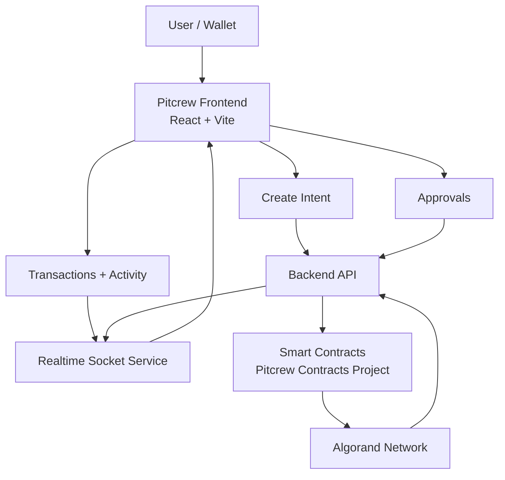
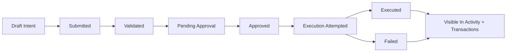

# Pitcrew Frontend

Frontend application for Pitcrew, an Algorand intent automation platform.

The frontend is the operator console for creating intents, approving actions, tracking execution, and monitoring live system activity.

## Table Of Contents

1. [Overview](#overview)
2. [Key Capabilities](#key-capabilities)
3. [System Architecture](#system-architecture)
4. [Intent Lifecycle](#intent-lifecycle)
5. [Application Modules](#application-modules)
6. [Tech Stack](#tech-stack)
7. [Prerequisites](#prerequisites)
8. [Setup](#setup)
9. [Scripts](#scripts)
10. [Environment And Network Notes](#environment-and-network-notes)
11. [Troubleshooting](#troubleshooting)
12. [Related Repositories And Docs](#related-repositories-and-docs)
13. [Roadmap](#roadmap)

## Overview

Pitcrew helps users move from manual transaction execution to intent-based automation.

Instead of watching markets continuously and sending transactions one-by-one, users define intents with conditions and execution preferences. The frontend provides the full UX layer around that flow:

- Define and submit intents
- Watch intent status changes in real time
- Approve and inspect pending actions
- Review historical activity and transaction outcomes
- Connect wallets and interact with Algorand network-aware clients

## Key Capabilities

- Intent creation workflows with structured forms
- Realtime updates for status and execution events
- Approval and transaction review screens
- Wallet connectivity for signing and account context
- Contract client integration generated from contract artifacts
- Dashboard and activity views for operational visibility

## System Architecture



## Intent Lifecycle



## Application Modules

### Pages

- Dashboard
- Create Intent
- Approvals
- Transactions
- Intent Details
- Activity

### Core Components

- Intent creation and display: `IntentForm`, `IntentCard`, `IntentsList`, `IntentsTable`
- Execution and approvals: `Transact`, `TxApproval`, `TransactionsTable`, `StatusBadge`
- Wallet and account: `ConnectWallet`, `Account`
- Live market and data helpers: `PriceTicker`
- App shell and resilience: `AppShell`, `ErrorBoundary`

### Data And Realtime Layer

- API service: `src/services/intentApi.ts`
- Socket service: `src/services/socket.ts`
- Realtime context state: `src/context/IntentRealtimeContext.tsx`

### Smart Contract Clients

- Generated clients are consumed under `src/contracts`
- Client linking occurs via `generate:app-clients` script

## Tech Stack

- React 18
- TypeScript
- Vite 5
- React Router
- Recharts
- Axios
- Socket.IO client
- Algorand SDK and AlgoKit Utils
- use-wallet integrations (`@txnlab/use-wallet`, `@txnlab/use-wallet-react`)

## Prerequisites

- Node.js 20+
- npm 9+
- AlgoKit CLI
- Docker (for LocalNet workflows)

## Setup

### Option A: Bootstrap Entire Monorepo

From repository root:

```bash
algokit project bootstrap all
```

### Option B: Frontend-Only Setup

```bash
cd projects/Pitcrew-frontend
npm install
```

## Scripts

From `projects/Pitcrew-frontend`:

- `npm run generate:app-clients`
  - Links generated smart-contract app clients from workspace projects.
- `npm run dev`
  - Runs client linking, then starts Vite dev server.
- `npm run build`
  - Runs client linking, TypeScript compile, and production build.
- `npm run preview`
  - Serves built assets locally for verification.

## Environment And Network Notes

- Local development is typically run against AlgoKit LocalNet.
- Ensure contracts are built so app clients are available before frontend runtime.
- If wallet/network state appears inconsistent, verify the selected network and restart LocalNet.

## Troubleshooting

### App Clients Not Found

1. Build contracts in the contracts project.
2. Run `npm run generate:app-clients`.
3. Restart frontend dev server.

### Wallet Connection Issues

1. Confirm wallet extension/app is installed and unlocked.
2. Confirm network alignment (LocalNet/TestNet/MainNet as configured).
3. Refresh session and reconnect wallet.

### Realtime Updates Missing

1. Verify backend service is running.
2. Verify socket endpoint configuration.
3. Check browser console/network tab for websocket errors.

## Related Repositories And Docs

- Root workspace README: [../../README.md](../../README.md)
- Backend README: [../Pitcrew-backend/README.md](../Pitcrew-backend/README.md)
- Contracts README: [../Pitcrew-contracts/README.md](../Pitcrew-contracts/README.md)
- Frontend contract integration notes: [src/contracts/README.md](src/contracts/README.md)

## Roadmap

- Stronger validation and simulation for intent configuration
- Expanded analytics around execution performance
- Richer multi-wallet and signer flows
- More granular alerting and notifications for lifecycle events
